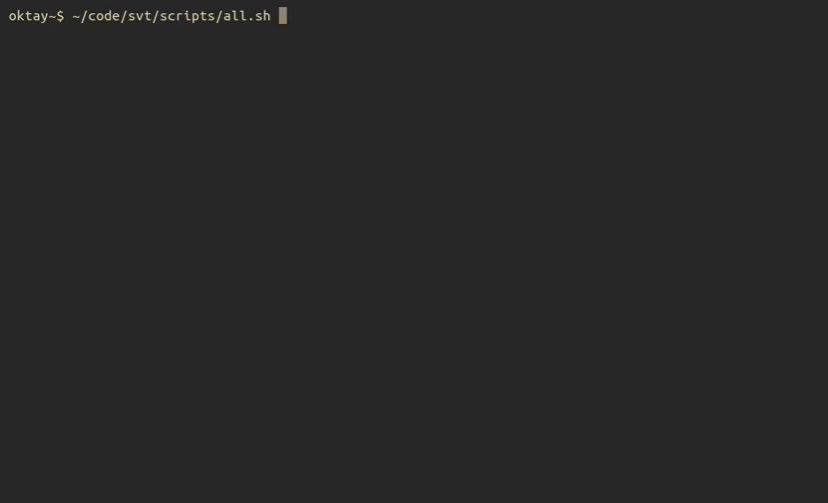

# svt

A minimal looking customizable  **Sorting Visualizer** for the **Terminal**



## Installation

Install it to your `$GOPATH/bin` using the `go install` command:

```console
$ go install github.com/aod/svt/cmd/svt
```

## Usage

```console
$ svt --help
Usage of svt:
  -a int
        Array size (default 12)
  -algorithms
        Print out all available sorting algorithms
  -d duration
        Delay between sorts (default 16ms)
  -q    Automatically quit after it's done sorting
  -s value
        Sorting algorithm, choose from:
        bubble, bogo, cocktail or selection (default bubble)
  -t int
        Column thiccness (default 4)
```
